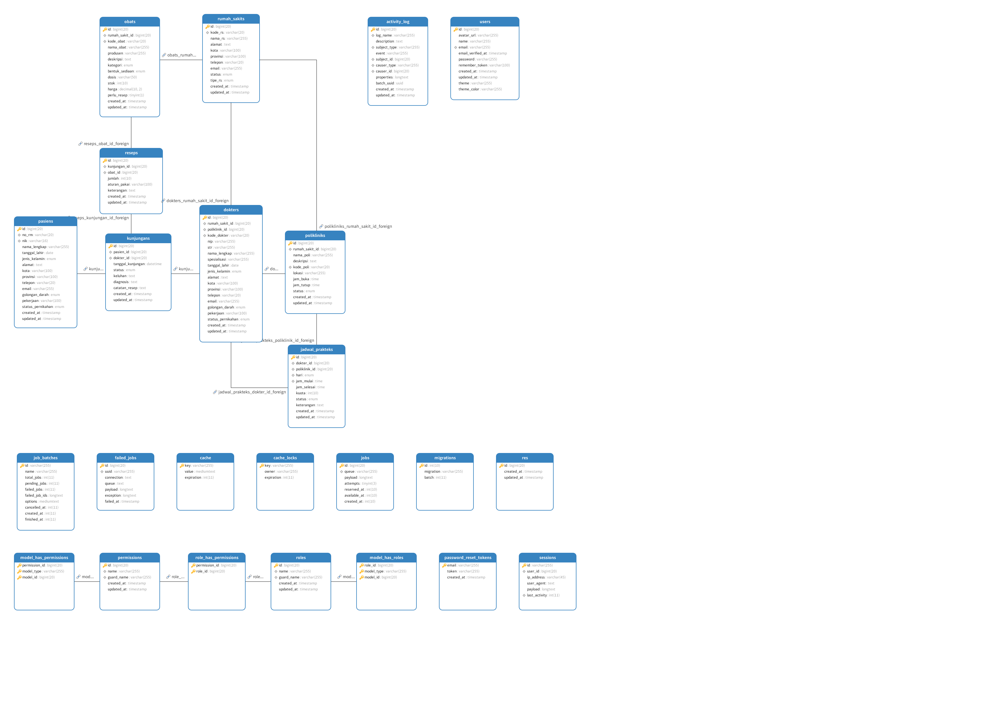

# UTS BASIS DATA SISTEM RUMAH SAKIT

Sebuah aplikasi web berbasis Laravel untuk mengelola data operasional rumah sakit, termasuk manajemen pasien, dokter, jadwal, dan rekam medis elektronik (RME) sederhana.

---

## 1. Struktur Database (ERD)

Desain database mengikuti alur operasional rumah sakit. Gambar ERD di bawah ini menunjukkan relasi antar tabel utama.



---

## 2. Table Rumah Sakit

## A. Migration: Struktur Database
**File:** `database/migrations/xxxx_xx_xx_create_rumah_sakits_table.php`

Tabel `rumah_sakits` dirancang untuk menyimpan detail operasional dan administratif rumah sakit.

| Nama Kolom | Tipe Data | Aturan / Keterangan |
| :--- | :--- | :--- |
| `id` | BigInt (PK) | Auto Increment. |
| `kode_rs` | String(20) | **Unique**. Kode identifikasi unik untuk setiap RS (misal: RS001). |
| `nama_rs` | String | Nama lengkap rumah sakit. |
| `alamat` | Text | Alamat lengkap. |
| `kota` | String(100) | Kota domisili. |
| `provinsi` | String(100) | Provinsi domisili. |
| `telepon` | String(20) | Nomor telepon operasional. |
| `email` | String | (Nullable) Email resmi, boleh dikosongkan. |
| `status` | Enum | Pilihan: `'aktif'`, `'nonaktif'`. Default: `'aktif'`. |
| `tipe_rs` | Enum | Pilihan: `'A'`, `'B'`, `'C'`. Default: `'C'` (Kelas RS). |
| `timestamps`| DateTime | Mencatat `created_at` dan `updated_at` otomatis. |

### 💡 Penjelasan Teknis Migration
* **Unique Constraint (`kode_rs`):** Kita menggunakan `$table->string('kode_rs', 20)->unique();` untuk menjamin tidak ada dua rumah sakit yang memiliki kode sistem yang sama.
* **Enum Types:** Penggunaan tipe data `enum` pada `status` dan `tipe_rs` bertujuan untuk menjaga konsistensi data (Data Integrity), membatasi input hanya pada nilai yang diizinkan sistem.
* **Default Values:** Memberikan nilai default (`'aktif'` dan `'C'`) memudahkan proses input data jika informasi tersebut belum tersedia.

---

## B. Model: Logika Aplikasi
**File:** `app/Models/RumahSakit.php`

Model ini bertugas sebagai jembatan antara aplikasi Laravel dengan tabel `rumah_sakits`.

```php
class RumahSakit extends Model
{
    use HasFactory;
    
    // Mass Assignment Protection
    protected $guarded = ['id'];
}

---

## 2. Database Seeder

Proyek ini dilengkapi dengan seeder untuk data dummy. Perintah `php artisan migrate:fresh --seed` akan menjalankan `DatabaseSeeder` yang memanggil seeder berikut **secara berurutan**:

1.  **RumahSakitSeeder**: Mengisi 5 data rumah sakit.
2.  **PoliklinikSeeder**: Mengisi 5 data poliklinik (terhubung ke RS).
3.  **PasienSeeder**: Mengisi 5 data pasien.
4.  **DokterSeeder**: Mengisi 5 data dokter (terhubung ke RS & Poli).
5.  **ObatSeeder**: Mengisi 5 data obat (terhubung ke RS).
6.  **JadwalPraktekSeeder**: Mengisi 5 data jadwal (terhubung ke Dokter & Poli).
7.  **KunjunganSeeder**: Mengisi 5 data kunjungan (terhubung ke Pasien & Dokter).
8.  **ResepSeeder**: Mengisi 5 data resep (terhubung ke Kunjungan & Obat).

---
